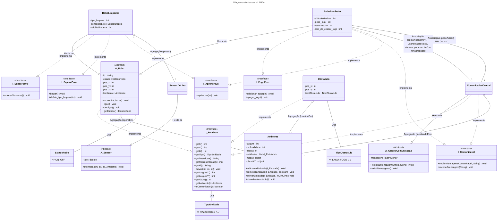

# INTRO
Repositório contendo todos os laboratórios da matéria MC322 (Programação orientada a objetos) da UNICAMP.
A disciplina é ministrada em JAVA e essa é a linguagem em que os laboratórios foram programados.
Cada laboratório foi dividido em seu próprio conjunto de pastas e os comandos devem ser rodados a partir da pasta root do repositório.

- Todos os laboratórios foram feitos em JAVA exclusivamente.
- **Autores**: Kauan Aprigio Estevão (260205) e Diego Martins Santos (288809)

# IDE e JAVA
- **JAVA versão**: 21+
- **IDE**: [Visual Studio Code](https://code.visualstudio.com/)

---

# LAB 2

### COMPILAÇÃO:
    javac -d LAB02/Classes LAB02/Code/*.java

### PARA RODAR:
    java -cp LAB02/Classes LAB02.Code.Main

---

# LAB 3
Diagrama de classes:
As classes são representadas de maneira simplificada, com algumas relações e métodos ocultados para evitar confusão visual.
Métodos Getters e Setters foram ocultados e a enumeração do tipoObstáculo foi separada da classe Obstáculo.
Além disso, as setas de agregação e dependência entre subclasses de robôs e subclasses de sensores não foram desenhadas.

### COMPILAÇÃO:
    javac -d LAB03/Classes LAB03/Code/*.java

### PARA RODAR:
    java -cp LAB03/Classes LAB03.Code.Main

---

# LAB 4

## Principais Mudanças (LAB03 -> LAB04)

O Laboratório 4 introduziu conceitos mais avançados de Orientação a Objetos, focando em **Interfaces**, **Classes Abstratas** e **Tratamento de Exceções**. As principais evoluções foram:

1.  **Interfaces**: Foram criadas diversas interfaces (`Entidade`, `Aprimoravel`, `Comunicavel`, `FogoZero`, `Sensoreavel`, `SujeiraZero`) para definir contratos de comportamento. Isso permitiu "simular" herança múltipla e desacoplar as classes, tornando o sistema mais flexível e extensível.
2.  **Classes Abstratas**: `Robo` e `Sensor` foram transformadas em classes abstratas, definindo comportamentos e atributos comuns, mas forçando subclasses a implementar métodos específicos. `CentralComunicacao` também foi introduzida como abstrata.
3.  **Tratamento de Exceções**: Um conjunto robusto de exceções personalizadas (`ForaDosLimitesException`, `LocalOcupadoException`, `ErrorLimpezaException`, etc.) foi implementado para lidar com erros de forma mais específica e clara.
4.  **`Ambiente` 3D**: A classe `Ambiente` foi aprimorada para gerenciar um mapa 3D (`TipoEntidade[][][]`) e um plano 2D (`char[][]`), permitindo um controle de posição e colisão mais preciso e complexo. A gestão de entidades foi unificada através da interface `Entidade`.
5.  **`ComunicadorCentral`**: Uma nova classe foi adicionada para gerenciar a comunicação entre entidades, especialmente para alertar sobre perigos como fogo.
6.  **Refatoração**: As classes de Robôs e Obstáculos foram refatoradas para implementar as novas interfaces e utilizar o novo `Ambiente` e o sistema de exceções.
7.  **Menu Interativo**: O menu foi aprimorado para refletir as novas funcionalidades e seguir as especificações, permitindo uma interação mais rica com a simulação.

## Diagrama de Classes - LAB04

## Interfaces Criadas

* **`I_Entidade`**: Contrato base para qualquer objeto que possa existir no `Ambiente` (Robôs, Obstáculos, Comunicador). Define métodos para posição, tipo, descrição, movimento e dimensões.
    * Implementada por: `A_Robo`, `Obstaculo`, `ComunicadorCentral`.
* **`I_Aprimoravel`**: Define o comportamento de entidades que podem ser melhoradas.
    * Implementada por: `RoboLimpador`, `RoboBombeiro`.
* **`I_Comunicavel`**: Define a capacidade de enviar e receber mensagens.
    * Implementada por: `RoboBombeiro`, `ComunicadorCentral`.
* **`I_FogoZero`**: Define as ações de um robô bombeiro para lidar com fogo.
    * Implementada por: `RoboBombeiro`.
* **`I_Sensoreavel`**: Define a capacidade de usar sensores.
    * Implementada por: `RoboLimpador`.
* **`I_SujeiraZero`**: Define as ações de um robô limpador.
    * Implementada por: `RoboLimpador`.

## Exceções Personalizadas

* **`ErrorAbastecimentoException`**: Lançada por `RoboBombeiro` ao tentar adicionar água de forma inadequada.
* **`ErrorApagarFogoException`**: Lançada por `RoboBombeiro` ao falhar em apagar fogo.
* **`ErrorAprimoramentoException`**: Lançada por `RoboLimpador` e `RoboBombeiro` ao falhar no aprimoramento.
* **`ErroComunicacaoException`**: Lançada por `ComunicadorCentral` em falhas de comunicação.
* **`ErrorLimpezaException`**: Lançada por `RoboLimpador` em falhas de limpeza.
* **`EntidadeNaoEncontradaException`**: Lançada por `Ambiente` ao não encontrar uma entidade.
* **`ForaDosLimitesException`**: Lançada por `Ambiente` para ações fora do mapa.
* **`LocalOcupadoException`**: Lançada por `Ambiente` para ações em locais já ocupados.
* **`NaoPodeVoarException`**: Lançada por `Ambiente` quando um robô não aéreo tenta voar.
* **`RoboDesligadoException`**: Lançada por `Robo` ou subclasses ao tentar ações enquanto desligado.

## Compilação e Execução

### COMPILAÇÃO:
    javac LAB04/Code/**/*.java LAB04/Code/Exceptions/*.java LAB04/Code/Interfaces/*.java LAB04/Code/AbstractClasses/*.java -d LAB04/Classes

### PARA RODAR:
    java -cp LAB04/Classes LAB04.Code.Main
