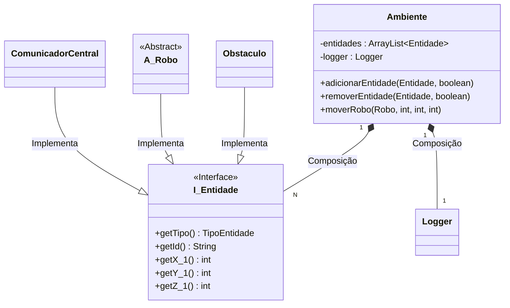
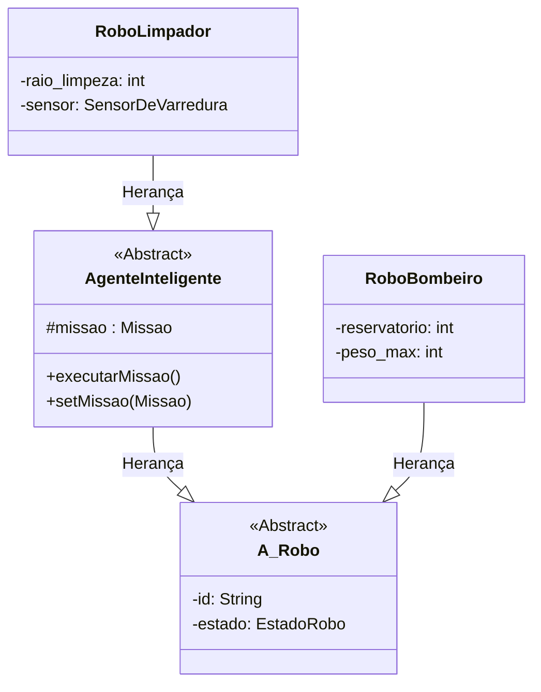
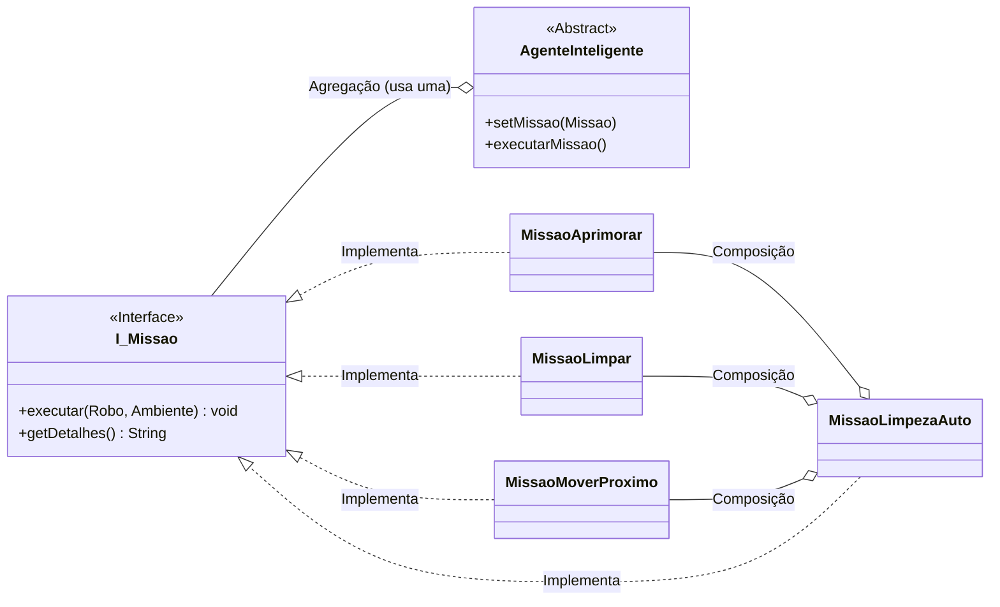
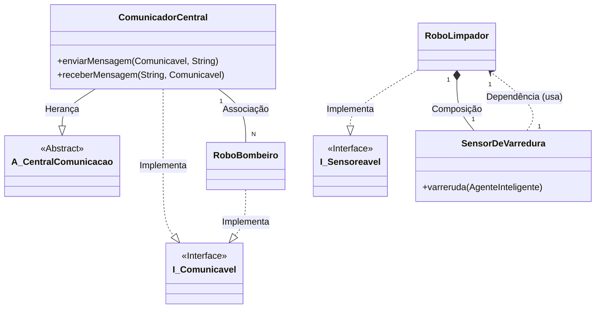

# INTRO

Repositório contendo todos os laboratórios da matéria MC322 (Programação orientada a objetos) da UNICAMP.
A disciplina é ministrada em JAVA e essa é a linguagem em que os laboratórios foram programados.
Cada laboratório foi dividido em seu próprio conjunto de pastas e os comandos devem ser rodados a partir da pasta root do repositório.

  - Todos os laboratórios foram feitos em JAVA exclusivamente.
  - **Autores**: Kauan Aprigio Estevão (260205) e Diego Martins Santos (288809)

# IDE e JAVA

  - **JAVA versão**: 21+
  - **IDE**: [Visual Studio Code](https://code.visualstudio.com/)

-----

# LAB 2

### COMPILAÇÃO:

```
javac -d LAB02/Classes LAB02/Code/*.java
```

### PARA RODAR:

```
java -cp LAB02/Classes LAB02.Code.Main
```

-----

# LAB 3

Diagrama de classes:
As classes são representadas de maneira simplificada, com algumas relações e métodos ocultados para evitar confusão visual.
Métodos Getters e Setters foram ocultados e a enumeração do tipoObstáculo foi separada da classe Obstáculo.
Além disso, as setas de agregação e dependência entre subclasses de robôs e subclasses de sensores não foram desenhadas.


### COMPILAÇÃO:

```
javac -d LAB03/Classes LAB03/Code/*.java
```

### PARA RODAR:

```
java -cp LAB03/Classes LAB03.Code.Main
```

-----

# LAB 4

## Principais Mudanças (LAB03 -\> LAB04)

O Laboratório 4 introduziu conceitos mais avançados de Orientação a Objetos, focando em **Interfaces**, **Classes Abstratas** e **Tratamento de Exceções**. As principais evoluções foram:

1.  **Interfaces**: Foram criadas diversas interfaces (`Entidade`, `Aprimoravel`, `Comunicavel`, `FogoZero`, `Sensoreavel`, `SujeiraZero`) para definir contratos de comportamento. Isso permitiu "simular" herança múltipla e desacoplar as classes, tornando o sistema mais flexível e extensível.
2.  **Classes Abstratas**: `Robo` e `Sensor` foram transformadas em classes abstratas, definindo comportamentos e atributos comuns, mas forçando subclasses a implementar métodos específicos. `CentralComunicacao` também foi transformada em abstrata.
3.  **Tratamento de Exceções**: Um conjunto robusto de exceções personalizadas (`ForaDosLimitesException`, `LocalOcupadoException`, `ErrorLimpezaException`, etc.) foi implementado para lidar com erros de forma mais específica e clara.
4.  **`Ambiente` 3D**: A classe `Ambiente` foi aprimorada para gerenciar um mapa 3D (`TipoEntidade[][][]`) e um plano 2D (`char[][]`) \*, permitindo um controle de posição e colisão mais preciso e complexo. A gestão de entidades foi unificada através da interface `Entidade`.
5.  **`ComunicadorCentral`**: Uma nova classe foi adicionada para gerenciar a comunicação entre entidades, especialmente para alertar sobre perigos como fogo. Ela herda a classe abstrata `CentralComunicacao` e implementa a interface `Comunicavel`.
6.  **Refatoração**: As subclasses de Robôs e a classe Obstáculo foram refatoradas para implementar as novas interfaces e utilizar o novo `Ambiente` e o sistema de exceções.
7.  **Menu Interativo**: O menu foi aprimorado para refletir as novas funcionalidades e seguir as especificações, permitindo uma interação mais rica com a simulação.

<!-- end list -->

  * OBS: O plano 2D não fica legal em uma janela de terminal pequena. É recomendado utilizar o terminal em tela
    cheia para melhor experiência do simulador.

## Diagrama de Classes - LAB04

```mermaid
---
title: Diagrama de classes - LAB04
---
classDiagram
    direction TB

    class Ambiente {
        -largura : int
        -profundidade : int
        -altura : int
        -entidades : List~I_Entidade~
        -mapa : object
        -planoXY : object
        
        +adicionarEntidade(I_Entidade) void
        +removerEntidade(I_Entidade, boolean) void
        +moverEntidade(I_Entidade, int, int, int) void
        +visualizarAmbiente() void
        +inicializarMapa() void 
        +dentroDosLimites(int, int, int) boolean
        +estahOcupado(int, int, int, TipoEntidade) boolean
        +verificarColisoes(Entidade, int, int, int) boolean
    }
    class Obstaculo {
        -pos_x : int
        -pos_y : int
        -tipoObstaculo : TipoObstaculo
    }
    

    %% Enums
    class EstadoRobo { 
        <<enumeration>> 
        + ON 
        + OFF
    }
   class TipoObstaculo {
        <<enumeration>>
        + LAGO
        + FOGO
        + PREDIOEMCHAMAS
        + PREDIO
        + SUJEIRAENCARDIDA
        + COMIDANOCHAO
        + SACOLAPLASTICA
        + OFICINA
    }
    class TipoEntidade { <<enumeration>> 
        + VAZIO 
        + ROBO 
        + OBSTACULO 
        + COMUNICADOR 
        + DESCONHECIDO 
    }

    class I_Entidade {
        <<Interface>>
        +getX() int
        +getY() int
        +getZ() int
        +getTipo() TipoEntidade
        +getDescricao() String
        +getRepresentacao() char
        +getId() String
        +mover(int, int, int) void
        +getLarguraX() int
        +getLarguraY() int
        +getAltura() int
        +getAmbiente() Ambiente
        +isComunicavel() boolean
    }
    
    class A_Robo {
        <<Abstract>>
        -id : String
        -estado : EstadoRobo
        -pos_x : int
        -pos_y : int
        -pos_z : int
        #ambiente : Ambiente
        +mover(int, int, int) void
        +ligar() void
        +desligar() void
        +getEstado() EstadoRobo
    }
    
    

    class I_Aprimoravel {
        <<Interface>>
        +aprimorar() void
        +estahAprimorado() boolean
    }
    
    class I_Sensoreavel {
        <<Interface>>
        +acionarSensores() void
    }
    class I_SujeiraZero {
        <<Interface>>
        +limpar() void
        +definir_tipo_limpeza(int) void
    }
    class RoboLimpador {
        -tipo_limpeza : int
        -sensorDeLixo : SensorDeLixo
        -raioDeLimpeza : int
    }
    class I_Comunicavel {
        <<Interface>>
        +enviarMensagem(Comunicavel, String) void
        +receberMensagem(String, Comunicavel) void
    }
    class I_FogoZero {
        <<Interface>>
        +adicionar_agua() void
        +apagar_fogo() void
    }

    class RoboBombeiro {
        -altitudeMaxima : int
        -peso_max : int
        -reservatorio : int
        -raio_de_cessar_fogo : int
    }
    

    class A_Sensor {
        <<Abstract>>
        -raio : double
        +monitorar(int, int, int, Ambiente) void
    }
    

    class A_CentralComunicacao {
        <<Abstract>>
        -mensagens : List~String~
        +registrarMensagem(String, String) void
        +exibirMensagens() void
    }


    class ComunicadorCentral {
        +listarFogos() void
        +avisoFogoProximo(Entidade) void
        +local_Lago() void 
    }
    

    

    %% Relações
    RoboLimpador "1" o-- "1" SensorDeLixo : Agregação
    RoboBombeiro "1" -- "1" ComunicadorCentral : Associação
    ComunicadorCentral "1" -- "*" RoboBombeiro : Associação
    A_Robo "*" o-- "1" Ambiente : Agregação 
    Obstaculo "*" o-- "1" Ambiente : Agregação 
    ComunicadorCentral "1" o-- "1" Ambiente : Agregação
    ComunicadorCentral --|> A_CentralComunicacao : Herança
    ComunicadorCentral ..|> I_Entidade : Implementa
    ComunicadorCentral ..|> I_Comunicavel : Implementa
    SensorDeLixo --|> A_Sensor : Herança
    RoboBombeiro --|> A_Robo : Herança
    RoboBombeiro ..|> I_FogoZero : Implementa
    RoboBombeiro ..|> I_Comunicavel : Implementa
    RoboBombeiro ..|> I_Aprimoravel : Implementa
    RoboLimpador --|> A_Robo : Herança
    RoboLimpador ..|> I_Sensoreavel : Implementa
    RoboLimpador ..|> I_SujeiraZero : Implementa
    RoboLimpador ..|> I_Aprimoravel : Implementa
    A_Robo ..|> I_Entidade : Implementa
    Obstaculo ..|> I_Entidade : Implementa
```



## Interfaces Criadas

  * **`I_Entidade`**: Contrato base para qualquer objeto que possa existir no `Ambiente` (Robôs, Obstáculos, Comunicador). Define métodos para posição, tipo, descrição, movimento e dimensões.

      * Implementada por: `A_Robo`, `Obstaculo`, `ComunicadorCentral`.

  * **`I_Aprimoravel`**: Define o comportamento de entidades que podem ser melhoradas.

      * Implementada por: `RoboLimpador`, `RoboBombeiro`.

  * **`I_Comunicavel`**: Define a capacidade de enviar e receber mensagens.

      * Implementada por: `RoboBombeiro`, `ComunicadorCentral`.

  * **`I_FogoZero`**: Define as ações de um robô bombeiro para lidar com fogo.

      * Implementada por: `RoboBombeiro`.

  * **`I_Sensoreavel`**: Define a capacidade de usar sensores.

      * Implementada por: `RoboLimpador`.

  * **`I_SujeiraZero`**: Define as ações de um robô limpador.

      * Implementada por: `RoboLimpador`.

  * OBS: O Método `acionarsensores` foi removido da classe `ambiente` e sua funcionalidade foi passada para métodos
    da interface `Sensoreavel`. Assim, para acionar o sensor de um robô basta chamar a função `acionarsensores` própria do Robô

## Exceções Personalizadas

  * **`ErrorAbastecimentoException`**: Lançada por `RoboBombeiro` ao tentar adicionar água de forma inadequada.
  * **`ErrorApagarFogoException`**: Lançada por `RoboBombeiro` ao falhar em apagar fogo.
  * **`ErrorAprimoramentoException`**: Lançada por `RoboLimpador` e `RoboBombeiro` ao falhar no aprimoramento.
  * **`ErroComunicacaoException`**: Lançada por `ComunicadorCentral` em falhas de comunicação.
  * **`ErrorLimpezaException`**: Lançada por `RoboLimpador` quando ele recebe tipo de limpeza inválido.
  * **`EntidadeNaoEncontradaException`**: Lançada por `Ambiente` ao não encontrar uma entidade quando tenta mover ou remove-la.
  * **`ForaDosLimitesException`**: Lançada por `Ambiente` quando ações para fora do ambiente são tentadas.
  * **`LocalOcupadoException`**: Lançada por `Ambiente` quando obstáculos tentam se sobrepor ou quando robôs tentam acessar locais inválidos.
  * **`NaoPodeVoarException`**: Lançada por `Ambiente` quando algo que não seja um robô bombeiro tenta voar.
  * **`RoboDesligadoException`**: Lançada por `Robo` ou subclasses ao tentar ações enquanto desligado.

## Compilação e Execução

### COMPILAÇÃO:

```
javac LAB04/Code/**/*.java LAB04/Code/Exceptions/*.java LAB04/Code/Interfaces/*.java LAB04/Code/AbstractClasses/*.java -d LAB04/Classes
```

### PARA RODAR:

```
java -cp LAB04/Classes LAB04.Code.Main
```

-----

# LAB 5

## Principais Mudanças (LAB04 -\> LAB05)

O Laboratório 5 foca na introdução de **autonomia** e **comportamento estratégico** aos robôs, além de refinar a arquitetura do projeto. As principais evoluções são:

1.  **Agentes Inteligentes**: Foi introduzida a classe abstrata `AgenteInteligente`, que herda de `Robo`. Ela serve como base para robôs capazes de executar tarefas complexas de forma autônoma através de um sistema de missões.
2.  **Arquitetura de Missões**: Foi criado um sistema de missões com a interface `Missao`. Cada classe que implementa `Missao` encapsula um algoritmo ou estratégia (ex: `MissaoLimpar`, `MissaoAprimorar`). Isso permite que o comportamento de um `AgenteInteligente` seja alterado dinamicamente em tempo de execução, simplesmente atribuindo-lhe uma nova missão.
3.  **Sistema de Log (`Logger`):** Uma classe `Logger` foi implementada para registrar todas as ações, inicializações de missões e erros em um arquivo de texto (`Log.txt`). Isso cria um registro detalhado da simulação, facilitando a depuração e a verificação do comportamento dos agentes.
4.  **Leitor de Configuração (`LeitorConfig`):** Foi criado um leitor que inicializa o ambiente, os obstáculos e os robôs a partir de um arquivo `config.txt`. Isso desacopla a configuração do cenário do código-fonte, permitindo criar e testar diferentes simulações sem recompilar o programa.
5.  **Refatoração da Lógica de Sensores:** A lógica de sensores foi simplificada. O `RoboLimpador` agora utiliza um `SensorDeVarredura` que escaneia todo o ambiente de uma vez para encontrar lixo, em vez de depender de um raio de detecção limitado.

## Arquitetura de Missões e Agentes Inteligentes

A principal inovação do LAB5 é a capacidade dos robôs de agirem de forma autônoma. Isso foi alcançado através de dois componentes principais:

  - **`AgenteInteligente`**: Uma subclasse abstrata de `Robo` que introduz o conceito de ter uma `Missao` ativa. Esta classe serve como a base para qualquer robô que precise executar tarefas complexas sem intervenção direta a cada passo.
  - **`Missao`**: Uma interface que define um contrato com um único método: `executar()`. Cada implementação desta interface representa uma estratégia ou um comportamento completo, como `MissaoLimpezaAuto`, que comanda um robô a se aprimorar, encontrar e limpar todo o lixo do mapa.

## Sistema de Log (`Logger`)

Para rastrear as ações dos agentes e o estado da simulação, foi criada a classe `Logger`. Suas principais funções são:

  - **Registrar Ações:** Cria um arquivo `Log.txt` e registra eventos importantes, como a inicialização e finalização de missões e ações individuais (ex: mover, limpar, aprimorar).
  - **Hierarquia de Eventos:** O log é estruturado para mostrar ações dentro de missões, facilitando a leitura e a compreensão da sequência de eventos.
  - **Tratamento de Erros:** Exceções capturadas durante a execução são registradas no log, indicando o ponto da falha e a mensagem de erro, o que é crucial para a depuração.

## Sistema de Configuração (`LeitorConfig`)

Para tornar a simulação mais flexível, a classe `LeitorConfig` foi implementada para carregar a configuração do ambiente a partir de um arquivo `config.txt`.

  - **Inicialização Dinâmica:** Lê o arquivo `config.txt` para instanciar e posicionar obstáculos, robôs e o comunicador central no ambiente, eliminando a necessidade de "hardcodar" o cenário no método `main`.
  - **Atribuição de Missões:** O sistema também é responsável por interpretar as configurações de missões no arquivo e atribuí-las aos agentes inteligentes correspondentes, automatizando o início das operações autônomas.

## Diagramas de Classes - LAB05

Para melhor clareza, a arquitetura do LAB5 foi dividida em múltiplos diagramas.

### 1\. Núcleo do Ambiente e Entidades

Este diagrama mostra a relação central entre o `Ambiente` e as `Entidades` que ele gerencia.



### 2\. Hierarquia dos Robôs e Agentes

Este diagrama foca na especialização das classes de robôs.



### 3\. Sistema de Missões

Este diagrama ilustra a implementação da interface `Missao`.



### 4\. Comunicação e Sensores

Este diagrama mostra os sistemas de comunicação e sensoriamento.



## Interfaces Criadas

  * **`Entidade`**: Contrato fundamental para todos os objetos no ambiente, definindo propriedades básicas como posição, dimensões, tipo e ID.
  * **`Comunicavel`**: Define a capacidade de uma entidade de enviar e receber mensagens, essencial para a coordenação entre robôs e a central.
  * **`Sensoreavel`**: Contrato para entidades que podem executar ações de sensoriamento, como o `RoboLimpador` que varre o ambiente.
  * **`Missao`**: Definine o método `executar` que encapsula um comportamento ou tarefa autônoma. 

## Exceções Personalizadas

  * **`MissaoInvalidaException`**: Lançada quando uma missão é atribuída a um robô que não pode executá-la (ex: `MissaoLimpar` para um `RoboBombeiro`).
  * **`SemMissaoException`**: Lançada quando o método `executarMissao` de um `AgenteInteligente` é chamado, mas nenhuma missão foi atribuída.
  * **`ErroComunicacaoException`**: Lançada quando há uma falha na comunicação, como tentar enviar uma mensagem para um destinatário inexistente ou um robô desligado.
  * **`ErrorApagarFogoException`**: Lançada pelo `RoboBombeiro` se ele não tiver água suficiente ou se não houver fogo ao alcance para apagar.
  * **`ErrorAprimoramentoException`**: Lançada se um robô tentar se aprimorar quando não está em uma oficina ou se já foi aprimorado.
  * **`ErrorAbastecimentoException`**: Lançada pelo `RoboBombeiro` se ele tentar abastecer fora de um lago ou em uma altitude incorreta.
  * Exceções herdadas do LAB4, como `ForaDosLimitesException`, `LocalOcupadoException`, e `RoboDesligadoException`, continuam a ser usadas pela classe `Ambiente` e pelos robôs para gerenciar erros de posicionamento e estado.

## Missões Criadas

  * **`MissaoMoverProximo`**: Encapsula a lógica para um `RoboLimpador` identificar o lixo mais próximo em sua lista e se mover até ele.
  * **`MissaoLimpar`**: Contém a lógica para o `RoboLimpador` limpar todos os lixos que estão ao seu alcance, removendo-os do ambiente.
  * **`MissaoAprimorar`**: Define a estratégia para um robô localizar a oficina mais próxima, mover-se até ela e executar a ação de aprimoramento.
  * **`MissaoLimpezaAuto`**: Uma "meta-missão" que coordena outras missões. Ela comanda um `RoboLimpador` a primeiro se aprimorar, depois escanear o ambiente em busca de todo o lixo e, por fim, executar um ciclo de `MissaoMoverProximo` e `MissaoLimpar` até que todo o lixo seja removido.

## Compilação e Execução

### COMPILAÇÃO:

```
javac LAB05/src/**/*.java -d LAB05/bin
```

### PARA RODAR:

```
java -cp LAB05/bin LAB05.src.Main.Main
```