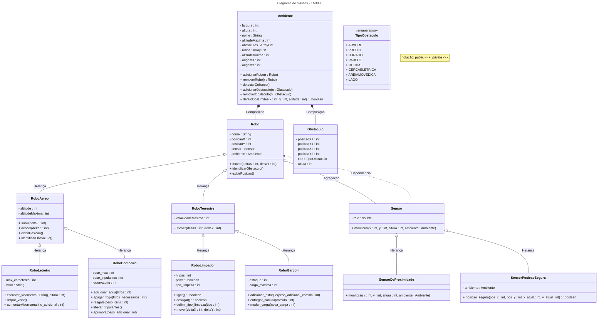

# INTRO
Repositório contendo todos os laboratórios da matéria MC322 (Programação orientada a objetos) da UNICAMP.\
A disciplina é ministrada em JAVA exclusivamente e essa a linguagem em que os laboratórios foram programados.\
Cada laboratório foi dividido em seu próprio conjunto de pastas e os comandos devem ser rodados a partir da pasta root do repositório.
-
Todos os laboratórios foram feitos em JAVA exclusivamente
# IDE e JAVA
JAVA versão 21+\
IDE utilizado para codar foi o [Visual Studio Code](https://code.visualstudio.com/)

# LAB 2

### COMPILAÇÃO:
    
    javac -d LAB02/Classes LAB02/Code/*.java

### PARA RODAR:

    java -cp LAB02/Classes LAB02.Code.Main 

# LAB 3
ESSE DIAGRAMA ESTA INCOMPLETO TERMINAR DPS

### COMPILAÇÃO:

    javac -d LAB03/Classes LAB03/Code/*.java

### PARA RODAR:

    java -cp LAB03/Classes LAB03.Code.Main 

