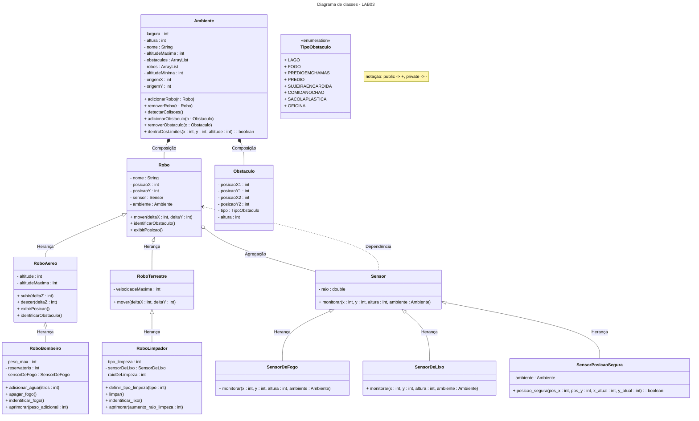

# INTRO
Repositório contendo todos os laboratórios da matéria MC322 (Programação orientada a objetos) da UNICAMP.
A disciplina é ministrada em JAVA e essa é a linguagem em que os laboratórios foram programados.
Cada laboratório foi dividido em seu próprio conjunto de pastas e os comandos devem ser rodados a partir da pasta root do repositório.

- Todos os laboratórios foram feitos em JAVA exclusivamente.
- **Autores**: Kauan Aprigio Estevão (260205) e Diego Martins Santos (288809)

# IDE e JAVA
- **JAVA versão**: 21+
- **IDE**: [Visual Studio Code](https://code.visualstudio.com/)

---

# LAB 2

### COMPILAÇÃO:
    javac -d LAB02/Classes LAB02/Code/*.java

### PARA RODAR:
    java -cp LAB02/Classes LAB02.Code.Main

---

# LAB 3
Diagrama de classes:\
As classes são representadas de maneira simplificada, com algumas relações e métodos ocultados para evitar confusão visual.\
Métodos Getters e Setters foram ocultados e a enumeração do tipoObstáculo foi separada da classe Obstáculo.\
Além disso, as setas de agregação e dependência entre subclasses de robôs e subclasses de sensores não foram desenhadas.



### COMPILAÇÃO:
    javac -d LAB03/Classes LAB03/Code/*.java

### PARA RODAR:
    java -cp LAB03/Classes LAB03.Code.Main

---

# LAB 4

## Principais Mudanças (LAB03 -> LAB04)

O Laboratório 4 introduziu conceitos mais avançados de Orientação a Objetos, focando em **Interfaces**, **Classes Abstratas** e **Tratamento de Exceções**. As principais evoluções foram:

1.  **Interfaces**: Foram criadas diversas interfaces (`Entidade`, `Aprimoravel`, `Comunicavel`, `FogoZero`, `Sensoreavel`, `SujeiraZero`) para definir contratos de comportamento. Isso permitiu "simular" herança múltipla e desacoplar as classes, tornando o sistema mais flexível e extensível.
2.  **Classes Abstratas**: `Robo` e `Sensor` foram (ou poderiam ser, no caso de `Robo`) transformadas em classes abstratas, definindo comportamentos e atributos comuns, mas forçando subclasses a implementar métodos específicos. `CentralComunicacao` também foi introduzida como abstrata.
3.  **Tratamento de Exceções**: Um conjunto robusto de exceções personalizadas (`ForaDosLimitesException`, `LocalOcupadoException`, `ErrorLimpezaException`, etc.) foi implementado para lidar com erros de forma mais específica e clara, substituindo simples `System.out.println` de erros.
4.  **`Ambiente` 3D**: A classe `Ambiente` foi aprimorada para gerenciar um mapa 3D (`TipoEntidade[][][]`) e um plano 2D (`char[][]`), permitindo um controle de posição e colisão mais preciso e complexo. A gestão de entidades foi unificada através da interface `Entidade`.
5.  **`ComunicadorCentral`**: Uma nova classe foi adicionada para gerenciar a comunicação entre entidades, especialmente para alertar sobre perigos como fogo.
6.  **Refatoração**: As classes de Robôs e Obstáculos foram refatoradas para implementar as novas interfaces e utilizar o novo `Ambiente` e o sistema de exceções.
7.  **Menu Interativo**: O menu foi aprimorado para refletir as novas funcionalidades e seguir as especificações, permitindo uma interação mais rica com a simulação.

## Diagrama de Classes - LAB04

```mermaid
---
title: Diagrama de classes - LAB04
---
classDiagram
    direction TB
    note "Interfaces são prefixadas com 'I_' e Classes Abstratas com 'A_'"

    interface I_Entidade {
        +getX() int
        +getY() int
        +getZ() int
        +getTipo() TipoEntidade
        +getDescricao() String
        +getRepresentacao() char
        +getId() String
        +mover(int, int, int)
        +getLarguraX() int
        +getLarguraY() int
        +getAltura() int
        +getAmbiente() Ambiente
        +isComunicavel() boolean
    }

    class A_Robo {
        <<Abstract>>
        -id : String
        -estado : EstadoRobo
        -pos_x : int
        -pos_y : int
        -pos_z : int
        #ambiente : Ambiente
        +mover(int, int, int)
        +ligar()
        +desligar()
        +getEstado() EstadoRobo
    }
    A_Robo ..|> I_Entidade

    class A_Sensor {
        <<Abstract>>
        -raio : double
        +monitorar(int, int, int, Ambiente)
    }

    class A_CentralComunicacao {
        <<Abstract>>
        -mensagens : ArrayList<String>
        +registrarMensagem(String, String)
        +exibirMensagens()
    }

    interface I_Aprimoravel { +aprimorar(int) }
    interface I_Comunicavel { +enviarMensagem(Comunicavel, String); +receberMensagem(String) }
    interface I_FogoZero { +adicionar_agua(int); +apagar_fogo() }
    interface I_Sensoreavel { +acionarSensores() }
    interface I_SujeiraZero { +limpar(); +definir_tipo_limpeza(int) }

    class RoboLimpador {
        -tipo_limpeza : int
        -sensorDeLixo : SensorDeLixo
        -raioDeLimpeza : int
    }
    RoboLimpador --|> A_Robo
    RoboLimpador ..|> I_Sensoreavel
    RoboLimpador ..|> I_SujeiraZero
    RoboLimpador ..|> I_Aprimoravel

    class RoboBombeiro {
        -altitudeMaxima : int
        -peso_max : int
        -reservatorio : int
        -raio_de_cessar_fogo : int
    }
    RoboBombeiro --|> A_Robo
    RoboBombeiro ..|> I_FogoZero
    RoboBombeiro ..|> I_Comunicavel
    RoboBombeiro ..|> I_Aprimoravel

    class SensorDeLixo { }
    SensorDeLixo --|> A_Sensor

    class Obstaculo {
        -pos_x : int
        -pos_y : int
        -tipoObstaculo : TipoObstaculo
    }
    Obstaculo ..|> I_Entidade

    class ComunicadorCentral { }
    ComunicadorCentral --|> A_CentralComunicacao
    ComunicadorCentral ..|> I_Entidade
    ComunicadorCentral ..|> I_Comunicavel

    class Ambiente {
        -largura : int
        -profundidade : int
        -altura : int
        -entidades : ArrayList<I_Entidade>
        -mapa : TipoEntidade[][][]
        -planoXY : char[][]
        +adicionarEntidade(I_Entidade)
        +removerEntidade(I_Entidade)
        +moverEntidade(I_Entidade, int, int, int)
        +visualizarAmbiente()
    }

    class Main {
        +main(String[])
    }

    RoboLimpador o-- SensorDeLixo
    RoboBombeiro o-- ComunicadorCentral : envia msg
    ComunicadorCentral o-- RoboBombeiro : envia msg
    A_Robo o-- Ambiente
    Obstaculo o-- Ambiente
    ComunicadorCentral o-- Ambiente
    Main ..> Ambiente
    Main ..> RoboLimpador
    Main ..> RoboBombeiro
    Main ..> ComunicadorCentral

    note for A_Robo "EstadoRobo (Enum)"
    note for Obstaculo "TipoObstaculo (Enum)"
    note for I_Entidade "TipoEntidade (Enum)"

    package Exceptions {
        class ErrorAbastecimentoException {}
        class ErrorApagarFogoException {}
        class ErrorAprimoramentoException {}
        class ErroComunicacaoException {}
        class ErrorLimpezaException {}
        class EntidadeNaoEncontradaException {}
        class ForaDosLimitesException {}
        class LocalOcupadoException {}
        class NaoPodeVoarException {}
        class RoboDesligadoException {}
    }

    RoboBombeiro ..> ErrorAbastecimentoException : throws
    RoboBombeiro ..> ErrorApagarFogoException : throws
    RoboLimpador ..> ErrorAprimoramentoException : throws
    RoboBombeiro ..> ErrorAprimoramentoException : throws
    ComunicadorCentral ..> ErroComunicacaoException : throws
    RoboLimpador ..> ErrorLimpezaException : throws
    Ambiente ..> EntidadeNaoEncontradaException : throws
    Ambiente ..> ForaDosLimitesException : throws
    Ambiente ..> LocalOcupadoException : throws
    Ambiente ..> NaoPodeVoarException : throws
    A_Robo ..> RoboDesligadoException : throws
    RoboLimpador ..> RoboDesligadoException : throws

```

## Interfaces Criadas

* **`I_Entidade`**: Contrato base para qualquer objeto que possa existir no `Ambiente` (Robôs, Obstáculos, Comunicador). Define métodos para posição, tipo, descrição, movimento e dimensões.
    * Implementada por: `A_Robo`, `Obstaculo`, `ComunicadorCentral`.
* **`I_Aprimoravel`**: Define o comportamento de entidades que podem ser melhoradas (geralmente em oficinas).
    * Implementada por: `RoboLimpador`, `RoboBombeiro`.
* **`I_Comunicavel`**: Define a capacidade de enviar e receber mensagens.
    * Implementada por: `RoboBombeiro`, `ComunicadorCentral`.
* **`I_FogoZero`**: Define as ações de um robô bombeiro para lidar com fogo.
    * Implementada por: `RoboBombeiro`.
* **`I_Sensoreavel`**: Define a capacidade de usar sensores (específico para o limpador neste lab).
    * Implementada por: `RoboLimpador`.
* **`I_SujeiraZero`**: Define as ações de um robô limpador.
    * Implementada por: `RoboLimpador`.

## Exceções Personalizadas

* **`ErrorAbastecimentoException`**: Lançada por `RoboBombeiro` ao tentar adicionar água fora de um lago, com valor inválido ou excedendo a capacidade.
* **`ErrorApagarFogoException`**: Lançada por `RoboBombeiro` ao tentar apagar fogo sem água suficiente, fora de alcance ou na altitude errada.
* **`ErrorAprimoramentoException`**: Lançada por `RoboLimpador` e `RoboBombeiro` ao tentar aprimorar fora de uma oficina ou com valor inválido.
* **`ErroComunicacaoException`**: Lançada por `ComunicadorCentral` ao tentar enviar mensagem para uma entidade não comunicável.
* **`ErrorLimpezaException`**: Lançada por `RoboLimpador` ao tentar limpar com tipo errado ou definir tipo inválido.
* **`EntidadeNaoEncontradaException`**: Lançada por `Ambiente` ao tentar remover uma entidade que não existe.
* **`ForaDosLimitesException`**: Lançada por `Ambiente` ao tentar adicionar ou mover uma entidade para fora do mapa.
* **`LocalOcupadoException`**: Lançada por `Ambiente` ao tentar adicionar ou mover uma entidade para um local já ocupado.
* **`NaoPodeVoarException`**: Lançada por `Ambiente` quando um robô não aéreo tenta se mover para uma altitude > 0.
* **`RoboDesligadoException`**: Lançada por `A_Robo` ou subclasses ao tentar executar ações (mover, usar sensores) enquanto desligado.

## Compilação e Execução

### COMPILAÇÃO:
    javac LAB04/Code/**/*.java LAB04/Code/Exceptions/*.java LAB04/Code/Interfaces/*.java LAB04/Code/AbstractClasses/*.java -d LAB04/Classes

### PARA RODAR:
    java -cp LAB04/Classes LAB04.Code.Main